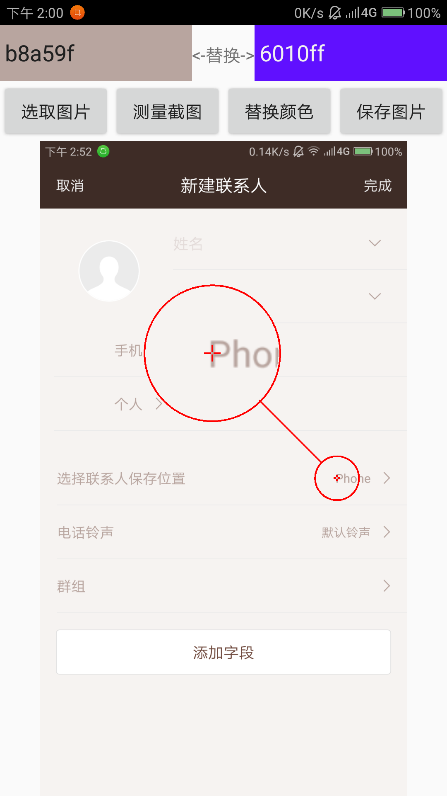
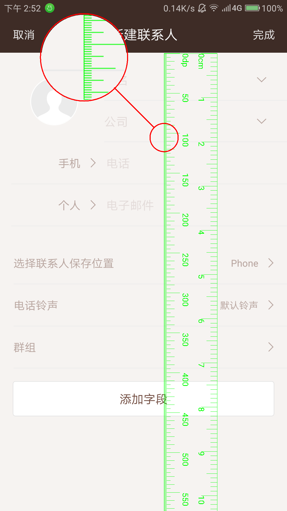
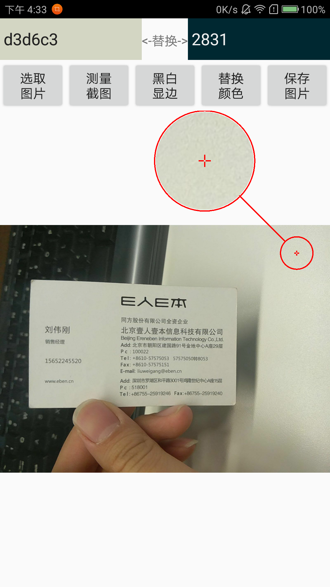
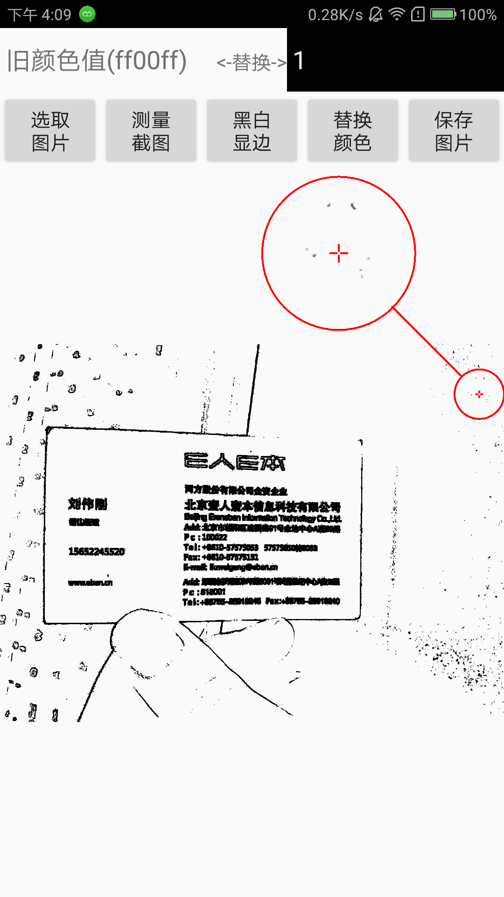
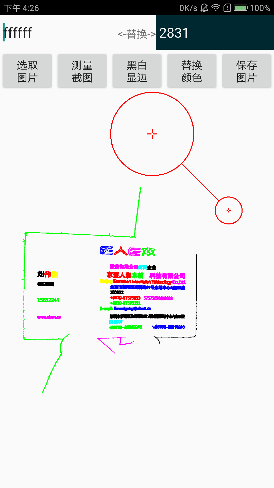

# ChangeRGB
可以将图片中一种颜色替换成另一种颜色，可以直接从图片取色。

## 由来
公司UI团建去泡温泉了，测试团队提了一个bug是图标颜色有问题，使用美图秀秀，图片工厂都只是美化方面功能，无法单一将图片某一颜色替换为另一个颜色，公司又不让使用盗版的PS软件。求人不如求己，干脆自己做一个图片颜色替换功能的demo。此demo就这么诞生了。

## 图片取色功能:
原始颜色框可输入颜色值，也可直接点击图片某一位置，获取颜色值。 
替换颜色框可输入新的颜色值，格式为f0f0f0红绿蓝，默认的透明度都是ff。 
当原始颜色框为空时，默认替换整个图片不透明位置的颜色为新的颜色。 
点击保存图片，即可将替换颜色后的图片保存到sd卡/ChangeRGB目录下 

## 测量截图功能：
默认打开最新截图也可以在上一个界面选择特定图片，提供dp尺子和厘米尺子。 
长按图片提供放大镜功能，方便读取微小刻度。 

## 黑白显边功能：
采用8-领域连通区域分析法，和阀值判断RGB相似度，黑白化图片，凸显出边框。 
旧颜色值输入框可以输入颜色判断的阀值 
新颜色值输入框会显示最后分析出的连通区一共有多少个 
先处理出轮廓边界黑白图片，再通过连通区递归算法过滤显示连通点大于limit的连通区标不同颜色显示出来 

## 截图：
###图片取色功能：

###测量截图功能：

###黑白显边功能：

